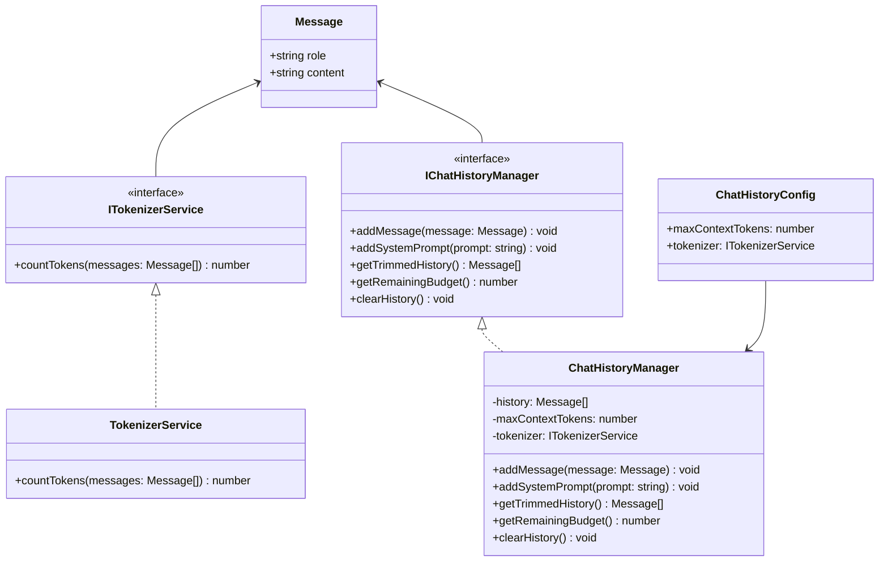

# Módulo Memory - Gerenciamento de Memória de Conversas

O módulo **Memory** é responsável pelo gerenciamento inteligente da memória de conversas em agentes de IA, implementando um sistema de truncamento baseado em tokens que garante que o contexto das conversas caiba dentro das limitações dos modelos de linguagem.

## Visão Geral

Este módulo resolve o problema fundamental de **limitação de contexto** em modelos de LLM, permitindo que agentes mantenham conversas extensas sem exceder os limites de tokens. Ele implementa uma estratégia inteligente de preservação que mantém sempre:

- **System Prompt** (primeira mensagem) - sempre preservado
- **Última mensagem do usuário** - sempre preservada  
- **Histórico intermediário** - truncado quando necessário

## Arquitetura

### Componentes Principais

```
src/memory/
├── memory.interface.ts      # Interfaces e contratos
├── tokenizer.ts            # Serviço de tokenização
├── chatHistoryManager.ts   # Gerenciador de histórico
├── index.ts               # Exports centralizados
└── README.md              # Esta documentação
```

### Diagrama de Classes



## Interfaces e Contratos

### Message
Representa uma única mensagem na conversa, compatível com os principais Providers (OpenAI, Claude, etc.).

```typescript
interface Message {
  role: string;      // 'system', 'user', 'assistant', 'tool'
  content: string;   // Conteúdo da mensagem
}
```

### ITokenizerService
Contrato para qualquer serviço que calcule o custo em tokens de uma lista de mensagens.

```typescript
interface ITokenizerService {
  countTokens(messages: Message[]): number;
}
```

### IChatHistoryManager
Contrato para o gerenciador de histórico de chat, responsável pela memória processual.

```typescript
interface IChatHistoryManager {
  addMessage(message: Message): void;
  addSystemPrompt(prompt: string): void;
  getTrimmedHistory(): Message[];
  getRemainingBudget(): number;
  clearHistory(): void;
}
```

### ChatHistoryConfig
Configuração para o gerenciador de histórico baseada em tokens.

```typescript
interface ChatHistoryConfig {
  maxContextTokens: number;    // Limite de tokens do modelo
  tokenizer: ITokenizerService; // Serviço de tokenização
}
```

## Implementações

### TokenizerService
Implementação atual do serviço de tokenização que utiliza uma **aproximação baseada em caracteres**:

- **1 token ≈ 4 caracteres** (proporção comum para modelos GPT)
- **Overhead fixo de 10 caracteres** por mensagem (simula estrutura JSON, roles, etc.)
- **⚠️ IMPORTANTE**: Esta é uma implementação placeholder. Para produção, substitua por:
  - `tiktoken` para modelos OpenAI
  - Claude API nativa para modelos Anthropic
  - Outros tokenizadores específicos por modelo

```typescript
// Exemplo de uso
const tokenizer = new TokenizerService('gpt-4');
const messages = [
  { role: 'user', content: 'Olá, como vai?' }
];
const tokens = tokenizer.countTokens(messages); // ~6 tokens
```

### ChatHistoryManager
Gerenciador principal que implementa a lógica de truncamento inteligente:

#### Estratégia de Preservação
1. **System Prompt** - Sempre na primeira posição, nunca removido
2. **Última mensagem do usuário** - Sempre preservada (contexto atual)
3. **Histórico intermediário** - Removido do mais antigo para o mais novo

#### Algoritmo de Truncamento
```typescript
// Pseudocódigo do algoritmo
while (totalTokens > maxContextTokens) {
    if (removableIndex >= lastProtectedIndex) {
        break; // Alerta: System Prompt + última mensagem excedem limite
    }
    removeMessage(removableIndex); // Remove mensagem mais antiga
}
```

## Uso Básico

### Instalação e Configuração

```typescript
import { ChatHistoryManager, TokenizerService } from '@/memory';

// 1. Criar o serviço de tokenização
const tokenizer = new TokenizerService('gpt-4');

// 2. Configurar o gerenciador
const config = {
  maxContextTokens: 8192,  // Limite do modelo
  tokenizer
};

const history = new ChatHistoryManager(config);
```

### Adicionar System Prompt

```typescript
// O System Prompt deve ser adicionado primeiro
history.addSystemPrompt(`
  Você é um assistente especializado em programação.
  Sempre forneça exemplos práticos e código limpo.
`);
```

### Gerenciar Conversa

```typescript
// Adicionar mensagens da conversa
history.addMessage({ role: 'user', content: 'Como fazer um loop em Python?' });
history.addMessage({ role: 'assistant', content: 'Você pode usar for ou while...' });
history.addMessage({ role: 'user', content: 'E para listas?' });

// Obter histórico truncado para enviar ao LLM
const messages = history.getTrimmedHistory();

// Verificar orçamento restante
const remaining = history.getRemainingBudget();
console.log(`Tokens restantes: ${remaining}`);
```

### Limpar Histórico

```typescript
// Limpa todo o histórico, preservando o System Prompt
history.clearHistory();

// Para uma limpeza completa (incluindo System Prompt)
history.clearHistory();
history.addSystemPrompt(''); // Adicionar prompt vazio
```

## Integração com Outros Módulos

### Com PromptBuilder

```typescript
import { PromptBuilder } from '@/promptBuilder';
import { ChatHistoryManager } from '@/memory';

const history = new ChatHistoryManager(config);
const messages = history.getTrimmedHistory();

const prompt = PromptBuilder.build({
  mode: 'chat',
  messages,
  context: {
    domain: 'programming',
    language: 'typescript'
  }
});
```

### Com Providers

```typescript
import { OpenAiProvider } from '@/providers';
import { ChatHistoryManager } from '@/memory';

const provider = new OpenAiProvider({ apiKey: '...' });
const history = new ChatHistoryManager(config);

// Adicionar mensagem do usuário
history.addMessage({ role: 'user', content: userInput });

// Obter contexto truncado
const messages = history.getTrimmedHistory();

// Enviar para o provider
const response = await provider.chat(messages);
```

## Testes

O módulo possui cobertura completa de testes unitários:

```bash
# Executar testes específicos do módulo memory
npm test -- --testPathPattern=memory

# Executar com cobertura
npm run test:coverage -- --coverageDirectory=coverage/memory
```

### Casos de Teste Principais

- ✅ Adição e substituição de System Prompt
- ✅ Truncamento inteligente preservando mensagens protegidas
- ✅ Cálculo correto de tokens
- ✅ Limpeza de histórico preservando System Prompt
- ✅ Tratamento de mensagens vazias ou undefined
- ✅ Cálculo de orçamento restante

## Configuração por Modelo

### Modelos OpenAI

```typescript
const openaiTokenizer = new TokenizerService('gpt-4');
const config = {
  maxContextTokens: 8192,
  tokenizer: openaiTokenizer
};
```

### Modelos Claude

```typescript
// Para Claude, considere implementar um tokenizador específico
const claudeTokenizer = new ClaudeTokenizer(); // Implementação customizada
const config = {
  maxContextTokens: 100000, // Claude tem limite maior
  tokenizer: claudeTokenizer
};
```

## Boas Práticas

### 1. Configuração Adequada
- Sempre defina `maxContextTokens` baseado no modelo específico
- Use tokenizadores específicos do modelo quando disponível

### 2. System Prompt
- Adicione o System Prompt **antes** de qualquer outra mensagem
- Mantenha-o conciso para preservar espaço para a conversa

### 3. Monitoramento
- Use `getRemainingBudget()` para monitorar o uso de tokens
- Implemente logs para acompanhar o truncamento

### 4. Performance
- O truncamento é executado a cada chamada de `getTrimmedHistory()`
- Considere cache se necessário para conversas muito longas

## Limitações Conhecidas

1. **Tokenizer Aproximado**: A implementação atual usa aproximação por caracteres
2. **Truncamento Linear**: Remove mensagens uma por vez (pode ser otimizado)
3. **Sem Persistência**: O histórico é mantido apenas em memória

## Roadmap

- [ ] Implementar tokenizadores específicos por modelo (tiktoken, Claude API)
- [ ] Adicionar persistência em banco de dados
- [ ] Implementar estratégias de compressão de histórico
- [ ] Adicionar métricas e monitoramento avançado
- [ ] Suporte para múltiplas sessões de conversa

## Troubleshooting

### Problema: "System Prompt e última mensagem excedem limite"
**Causa**: O System Prompt + última mensagem são maiores que `maxContextTokens`
**Solução**: 
- Reduza o System Prompt
- Diminua a última mensagem
- Aumente `maxContextTokens` se possível

### Problema: Truncamento muito agressivo
**Causa**: Tokenizador impreciso ou `maxContextTokens` muito baixo
**Solução**:
- Use tokenizador específico do modelo
- Ajuste `maxContextTokens` com margem de segurança

### Problema: Performance degradada
**Causa**: Histórico muito longo com truncamento frequente
**Solução**:
- Implemente cache do resultado de `getTrimmedHistory()`
- Considere estratégias de compressão

## Contribuindo

Para contribuir com este módulo:

1. Mantenha a compatibilidade com as interfaces existentes
2. Adicione testes para novas funcionalidades
3. Atualize a documentação JSDoc
4. Siga as diretrizes de estilo do projeto

## Licença

Este módulo é parte do frame-agent-sdk e segue a mesma licença do projeto principal.