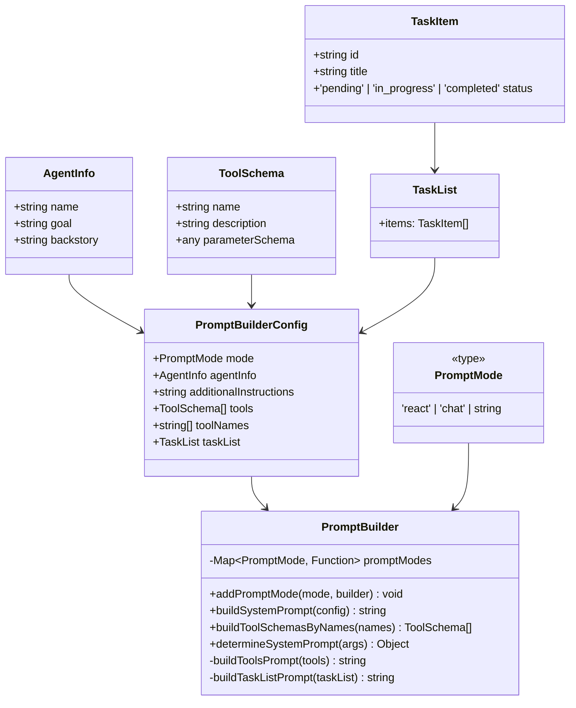

# Módulo PromptBuilder - Construção Inteligente de Prompts para LLMs

O módulo **PromptBuilder** é responsável pela construção inteligente e estruturada de prompts para modelos de linguagem, oferecendo um sistema flexível de templates e modos que permite criar prompts otimizados para diferentes tipos de agentes e casos de uso.

## Visão Geral

Este módulo resolve o problema fundamental de **construção de prompts complexos** para agentes de IA, implementando um sistema modular que:

- **Modos Estruturados**: Suporte para diferentes estratégias de prompting (chat, react, custom)
- **Templates Flexíveis**: Sistema de templates reutilizáveis e extensíveis
- **Integração com Tools**: Geração automática de schemas de ferramentas para LLMs
- **Contexto Inteligente**: Construção dinâmica baseada em informações do agente
- **Validação**: Sistema de validação de prompts e configurações

## Arquitetura

### Componentes Principais

```
src/promptBuilder/
├── promptBuilder.interface.ts    # Interfaces e contratos
├── promptBuilder.ts             # Classe principal PromptBuilder
├── index.ts                     # Exports centralizados
└── README.md                    # Esta documentação
```

### Diagrama de Classes



## Interfaces e Contratos

### AgentInfo
Informações essenciais do agente para compor o System Prompt.

```typescript
interface AgentInfo {
  name: string;        // Nome do agente
  goal: string;        // Objetivo/função do agente
  backstory: string;   // Contexto histórico e background
}
```

### ToolSchema
Schema de uma ferramenta para uso no System Prompt.

```typescript
type ToolSchema = Pick<ITool, 'name' | 'description' | 'parameterSchema'>;
```

### PromptBuilderConfig
Configuração completa para construir o System Prompt.

```typescript
interface PromptBuilderConfig {
  mode: PromptMode;                                    // Modo do agente
  agentInfo: AgentInfo;                                // Informações do agente
  additionalInstructions?: string;                     // Instruções extras
  tools?: ToolSchema[];                                // Tools já formatadas
  toolNames?: string[];                                // Nomes de tools para converter
  taskList?: {                                         // Lista de tarefas
    items: Array<{
      id: string;
      title: string;
      status: 'pending' | 'in_progress' | 'completed';
    }>
  };
}
```

### PromptMode
Tipos de modo suportados pelo sistema.

```typescript
type PromptMode = 'react' | 'chat' | string;
```

## Classe PromptBuilder

A classe principal que gerencia a construção de prompts com diferentes modos e estratégias.

### Métodos Principais

#### addPromptMode()
Registra um novo modo de prompt personalizado.

```typescript
public static addPromptMode(
  mode: PromptMode,
  builder: (config: PromptBuilderConfig) => string
): void
```

#### buildSystemPrompt()
Constrói o System Prompt completo baseado na configuração.

```typescript
public static buildSystemPrompt(config: PromptBuilderConfig): string
```

#### buildToolSchemasByNames()
Converte nomes de tools registradas em schemas tipados.

```typescript
public static buildToolSchemasByNames(names: string[]): ToolSchema[]
```

#### determineSystemPrompt()
Determina o systemPrompt a partir de diferentes fontes de entrada.

```typescript
public static determineSystemPrompt(args: {
  promptConfig?: PromptBuilderConfig;
  systemPrompt?: string;
  mode?: PromptMode;
  agentInfo?: AgentInfo;
  additionalInstructions?: string;
  tools?: ToolSchema[];
  taskList?: TaskList;
}): { systemPrompt: string; source: string }
```

## Estrutura do System Prompt

O System Prompt gerado segue uma estrutura otimizada para maximizar a atenção do LLM:

```markdown
# Agent Identity

Name: [Nome do Agente]
Role: [Objetivo/Função]
Backstory: [Contexto Histórico]

---

## Additional Instructions

[Instruções extras se fornecidas]

---

## Task List

- [pending] Tarefa 1 (id: task1)
- [completed] Tarefa 2 (id: task2)

---

## Tools

You have access to the following tools. Use them when necessary to achieve your goal.

Name: [tool_name]
Description: [descrição]
Parameters (Class Schema):
[class_schema]

---

[Regras específicas do modo - ex: regras do modo 'react' ou 'chat']
```

## Uso Básico

### Configuração Inicial

```typescript
import { PromptBuilder, AgentInfo } from '@/promptBuilder';

// Definir informações do agente
const agentInfo: AgentInfo = {
  name: 'Assistente de Programação',
  goal: 'Ajudar desenvolvedores com código limpo e boas práticas',
  backstory: 'Especialista em TypeScript e Node.js com 10 anos de experiência'
};
```

### Construção de Prompt Simples

```typescript
// Construir prompt básico
const prompt = PromptBuilder.buildSystemPrompt({
  mode: 'chat',
  agentInfo
});

console.log(prompt);
```

### Com Instruções Adicionais

```typescript
const prompt = PromptBuilder.buildSystemPrompt({
  mode: 'chat',
  agentInfo,
  additionalInstructions: `
    Sempre forneça exemplos práticos.
    Explique conceitos complexos de forma simples.
    Use markdown para formatação de código.
  `
});
```

### Com Lista de Tarefas

```typescript
const prompt = PromptBuilder.buildSystemPrompt({
  mode: 'react',
  agentInfo,
  taskList: {
    items: [
      { id: '1', title: 'Analisar código', status: 'pending' },
      { id: '2', title: 'Implementar função', status: 'in_progress' },
      { id: '3', title: 'Testar implementação', status: 'completed' }
    ]
  }
});
```

## Integração com Tools

### Usando Tool Names (Automático)

```typescript
const prompt = PromptBuilder.buildSystemPrompt({
  mode: 'react',
  agentInfo,
  toolNames: ['search', 'file_create', 'terminal', 'web_scraper']
});
```

### Usando Tool Schemas (Manual)

```typescript
const tools = [
  {
    name: 'search',
    description: 'Busca informações na web',
    parameterSchema: 'class SearchParams = { query: string, limit?: number }'
  },
  {
    name: 'file_create',
    description: 'Cria arquivos no sistema',
    parameterSchema: 'class FileCreateParams = { path: string, content: string }'
  }
];

const prompt = PromptBuilder.buildSystemPrompt({
  mode: 'react',
  agentInfo,
  tools
});
```

## Modos Personalizados

### Criando um Modo Customizado

```typescript
// Registrar novo modo
PromptBuilder.addPromptMode('analista_codigo', (config) => {
  return `
## Regras do Modo Analista de Código

1. Sempre analise a complexidade do código
2. Identifique possíveis melhorias
3. Sugira refatorações quando apropriado
4. Mantenha foco na performance e legibilidade
5. Forneça exemplos de implementação otimizada
  `;
});

// Usar o modo customizado
const prompt = PromptBuilder.buildSystemPrompt({
  mode: 'analista_codigo',
  agentInfo
});
```

### Modo React Avançado

```typescript
PromptBuilder.addPromptMode('react_avancado', (config) => {
  return `
## Modo React Avançado

Você é um agente de IA especializado em reasoning e action.

### Processo de Pensamento:
1. **ANÁLISE**: Analise cuidadosamente a solicitação
2. **PLANEJAMENTO**: Crie um plano step-by-step
3. **EXECUÇÃO**: Execute ações usando as tools disponíveis
4. **VERIFICAÇÃO**: Valide os resultados obtidos
5. **REFINAMENTO**: Refine a solução se necessário

### Diretrizes:
- Sempre pense antes de agir
- Explique seu reasoning
- Use tools de forma estratégica
- Valide resultados antes de prosseguir
- Seja transparente sobre limitações
  `;
});
```

## Integração com Outros Módulos

### Com Memory

```typescript
import { PromptBuilder } from '@/promptBuilder';
import { ChatHistoryManager } from '@/memory';

const history = new ChatHistoryManager(config);
const messages = history.getTrimmedHistory();

const prompt = PromptBuilder.buildSystemPrompt({
  mode: 'chat',
  agentInfo,
  additionalInstructions: 'Use o histórico fornecido para contexto.'
});
```

### Com Providers

```typescript
import { PromptBuilder } from '@/promptBuilder';
import { OpenAiProvider } from '@/providers';

const systemPrompt = PromptBuilder.buildSystemPrompt({
  mode: 'react',
  agentInfo,
  toolNames: ['search', 'calculator']
});

const provider = new OpenAiProvider({ apiKey: '...' });
const response = await provider.chat([
  { role: 'system', content: systemPrompt },
  { role: 'user', content: userInput }
]);
```

### Com Agents

```typescript
import { PromptBuilder } from '@/promptBuilder';
import { AgentConfig } from '@/agent';

const agentConfig: AgentConfig = {
  type: 'react',
  name: 'Assistente IA',
  goal: 'Resolver problemas complexos',
  backstory: 'Especialista em reasoning',
  tools: ['search', 'calculator', 'file_ops']
};

const systemPrompt = PromptBuilder.buildSystemPrompt({
  mode: agentConfig.type,
  agentInfo: {
    name: agentConfig.name,
    goal: agentConfig.goal,
    backstory: agentConfig.backstory
  },
  toolNames: agentConfig.tools
});
```

## Validação e Debugging

### Validação de Configuração

```typescript
function validatePromptConfig(config: PromptBuilderConfig): string[] {
  const errors: string[] = [];
  
  if (!config.mode) {
    errors.push('Mode é obrigatório');
  }
  
  if (!config.agentInfo?.name) {
    errors.push('Nome do agente é obrigatório');
  }
  
  if (!config.agentInfo?.goal) {
    errors.push('Objetivo do agente é obrigatório');
  }
  
  return errors;
}
```

### Debugging de Prompts

```typescript
// Log do prompt gerado para debug
const prompt = PromptBuilder.buildSystemPrompt(config);
console.log('Generated Prompt:', prompt);

// Verificar tamanho do prompt
const promptLength = prompt.length;
console.log(`Prompt length: ${promptLength} characters`);

// Verificar se contém elementos esperados
const hasIdentity = prompt.includes('# Agent Identity');
const hasTools = prompt.includes('## Tools');
const hasModeRules = prompt.includes('## Regras');

console.log({
  hasIdentity,
  hasTools,
  hasModeRules
});
```

## Testes

O módulo possui cobertura completa de testes unitários:

```bash
# Executar testes específicos do módulo promptBuilder
npm test -- --testPathPattern=promptBuilder

# Executar com cobertura
npm run test:coverage -- --coverageDirectory=coverage/promptBuilder
```

### Casos de Teste Principais

- ✅ Registro e uso de modos customizados
- ✅ Construção de system prompts básicos
- ✅ Inclusão de instruções adicionais
- ✅ Validação de modos não registrados
- ✅ Integração com task lists
- ✅ Geração de schemas de tools
- ✅ Determinação automática de system prompt
- ✅ Tratamento de tools sem parâmetros

## Boas Práticas

### 1. Estrutura de AgentInfo
```typescript
// ✅ Bom: Específico e detalhado
const agentInfo = {
  name: 'Assistente de Programação TypeScript',
  goal: 'Ajudar desenvolvedores a escrever código TypeScript limpo e eficiente',
  backstory: 'Especialista em TypeScript, Node.js e arquitetura de software com foco em performance e manutenibilidade'
};

// ❌ Ruim: Genérico e vago
const agentInfo = {
  name: 'Bot',
  goal: 'Ajudar',
  backstory: 'Sou um bot útil'
};
```

### 2. Instruções Adicionais
```typescript
// ✅ Bom: Específicas e acionáveis
const instructions = `
  - Sempre forneça exemplos práticos
  - Explique o "porquê" além do "como"
  - Use markdown para formatação
  - Valide inputs antes de processar
`;

// ❌ Ruim: Genéricas
const instructions = 'Seja útil e prestativo';
```

### 3. Organização de Tools
```typescript
// ✅ Bom: Tools relacionadas e organizadas
const toolNames = [
  'file_read',      // Operações de arquivo
  'file_write',     // Operações de arquivo
  'file_delete'     // Operações de arquivo
];

// ❌ Ruim: Tools aleatórias
const toolNames = ['search', 'weather', 'calculator', 'joke'];
```

### 4. Modos Customizados
```typescript
// ✅ Bom: Modo específico e bem definido
PromptBuilder.addPromptMode('code_reviewer', (config) => `
  ## Modo Code Reviewer
  
  Você é um especialista em code review focado em:
  1. Qualidade de código
  2. Performance
  3. Segurança
  4. Manutenibilidade
`);

// ❌ Ruim: Modo muito genérico
PromptBuilder.addPromptMode('helper', () => 'Seja útil');
```

## Configuração por Caso de Uso

### Agente de Chat Simples

```typescript
const chatConfig = {
  mode: 'chat',
  agentInfo: {
    name: 'Assistente Virtual',
    goal: 'Responder perguntas de forma clara e útil',
    backstory: 'Assistente especializado em fornecer informações precisas'
  },
  additionalInstructions: `
    - Seja conciso mas completo
    - Use exemplos quando apropriado
    - Admitir quando não souber algo
  `
};
```

### Agente React Complexo

```typescript
const reactConfig = {
  mode: 'react',
  agentInfo: {
    name: 'Agente de Pesquisa',
    goal: 'Realizar pesquisas abrangentes e análises detalhadas',
    backstory: 'Especialista em metodologia de pesquisa e análise de dados'
  },
  toolNames: ['web_search', 'data_analyzer', 'report_generator'],
  taskList: {
    items: [
      { id: '1', title: 'Definir escopo da pesquisa', status: 'completed' },
      { id: '2', title: 'Coletar dados', status: 'in_progress' },
      { id: '3', title: 'Analisar resultados', status: 'pending' }
    ]
  }
};
```

### Agente Especializado

```typescript
const specialistConfig = {
  mode: 'code_assistant',
  agentInfo: {
    name: 'Assistente de Desenvolvimento',
    goal: 'Ajudar desenvolvedores a escrever código melhor',
    backstory: 'Engenheiro de software sênior com expertise em múltiplas linguagens'
  },
  additionalInstructions: `
    - Sempre considere performance
    - Sugira melhorias de arquitetura
    - Forneça alternativas quando possível
    - Explique trade-offs
  `,
  tools: ['code_analyzer', 'test_generator', 'documentation_builder']
};
```

## Limitações Conhecidas

1. **Dependência do ToolRegistry**: Requer que tools estejam registradas
2. **Schema Generation**: Pode falhar para tools complexas
3. **Prompt Length**: Prompts muito longos podem exceder limites do modelo
4. **Mode Registration**: Modos devem ser registrados antes do uso

## Troubleshooting

### Problema: "Mode não registrado"
**Causa**: Modo não foi registrado via `addPromptMode()`
**Solução**:
```typescript
// Registrar o modo antes de usar
PromptBuilder.addPromptMode('custom_mode', (config) => 'Custom prompt');
```

### Problema: "Tool não encontrada"
**Causa**: Tool não está registrada no ToolRegistry
**Solução**:
```typescript
// Verificar se a tool existe
const tool = toolRegistry.getTool('tool_name');
if (!tool) {
  console.error('Tool não encontrada:', 'tool_name');
}
```

### Problema: Schema generation falha
**Causa**: Tool com estrutura complexa ou inválida
**Solução**:
```typescript
// Usar schema manual como fallback
const tools = [{
  name: 'complex_tool',
  description: 'Descrição da tool',
  parameterSchema: 'class Params = { param1: string, param2: number }'
}];
```

### Problema: Prompt muito longo
**Causa**: Muitas instruções ou tools
**Solução**:
```typescript
// Otimizar instruções
const instructions = instructions.slice(0, 500); // Limitar tamanho

// Ou dividir em partes
const prompt = PromptBuilder.buildSystemPrompt({
  mode: 'chat',
  agentInfo: optimizedAgentInfo,
  additionalInstructions: optimizedInstructions
});
```

## Roadmap

- [ ] Suporte a templates de prompt em arquivos externos
- [ ] Validação automática de prompts (linting)
- [ ] Otimização automática de prompt length
- [ ] Sistema de versionamento de prompts
- [ ] Integração com A/B testing de prompts
- [ ] Métricas de effectiveness de prompts
- [ ] Suporte a multimodal prompts (texto + imagem)

## Contribuindo

Para contribuir com este módulo:

1. Mantenha compatibilidade com interfaces existentes
2. Adicione testes para novas funcionalidades
3. Atualize documentação JSDoc
4. Siga padrões de nomenclatura estabelecidos
5. Teste integração com outros módulos

## Licença

Este módulo é parte do frame-agent-sdk e segue a mesma licença do projeto principal.
const prompt = PromptBuilder.build({
  mode: 'chat',
  messages,
  systemPrompt: 'Você é um especialista em geografia.'
});

// Saída: Prompt formatado para modo chat
```

### Modo React com Ferramentas
```typescript
import { PromptBuilder } from './promptBuilder';
import { SearchTool, CalculatorTool } from '../tools';

const messages: Message[] = [
  { role: 'user', content: 'Qual é a população de Tóquio e qual a raiz quadrada dela?' }
];

const tools = [
  new SearchTool(),
  new CalculatorTool()
];

// Construir prompt react
const prompt = PromptBuilder.build({
  mode: 'react',
  messages,
  tools: tools.map(tool => tool.getSchema()),
  agentInfo: {
    name: 'Assistente Matemático',
    goal: 'Realizar cálculos e buscas',
    backstory: 'Especialista em análise de dados'
  }
});

// Saída: Prompt estruturado para modo react com ferramentas
```

### Prompt com Informações do Agente
```typescript
import { PromptBuilder } from './promptBuilder';

const agentInfo = {
  name: 'Analisador de Dados',
  goal: 'Analisar e interpretar dados complexos',
  backstory: 'Especialista em estatística e análise de dados com 10 anos de experiência'
};

const prompt = PromptBuilder.build({
  mode: 'chat',
  messages: [
    { role: 'user', content: 'Analise estes dados de vendas.' }
  ],
  agentInfo,
  context: {
    dataSource: 'vendas_2024.csv',
    analysisType: 'tendências mensais'
  }
});
```

### Prompt Customizado com Template
```typescript
import { PromptBuilder } from './promptBuilder';

// Template customizado
const customTemplate = `
Você é {agentName}, {agentGoal}.

Contexto: {context}

Instruções: {instructions}

Histórico da conversa:
{conversationHistory}

Com base nas informações acima, responda à seguinte pergunta:
{userQuestion}
`;

const prompt = PromptBuilder.build({
  mode: 'custom',
  template: customTemplate,
  variables: {
    agentName: 'Assistente Financeiro',
    agentGoal: 'especialista em análise de investimentos',
    context: 'Análise de portfólio de ações',
    instructions: 'Forneça recomendações baseadas em dados históricos',
    conversationHistory: messages.map(m => `${m.role}: ${m.content}`).join('\n'),
    userQuestion: 'Devo investir em tecnologia ou energia renovável?'
  }
});
```

### Construção com Configuração Detalhada
```typescript
import { PromptBuilder } from './promptBuilder';

const config = {
  mode: 'react' as const,
  systemPrompt: 'Você é um assistente de pesquisa acadêmica.',
  agentInfo: {
    name: 'Pesquisador Acadêmico',
    goal: 'Realizar pesquisas acadêmicas rigorosas',
    backstory: 'PhD em Ciência da Computação com foco em IA'
  },
  tools: [
    {
      name: 'search_arxiv',
      description: 'Pesquisar artigos no arXiv',
      parameters: {
        query: { type: 'string', description: 'Termo de pesquisa' },
        max_results: { type: 'number', description: 'Máximo de resultados' }
      }
    },
    {
      name: 'summarize_paper',
      description: 'Resumir artigo acadêmico',
      parameters: {
        paper_id: { type: 'string', description: 'ID do artigo' }
      }
    }
  ],
  context: {
    research_area: 'Inteligência Artificial',
    publication_year: '2024',
    methodology: 'systematic_review'
  },
  maxTokens: 2000,
  temperature: 0.3
};

const prompt = PromptBuilder.build(config);
```

### Validação de Prompt
```typescript
import { PromptBuilder } from './promptBuilder';

const prompt = 'Texto do prompt aqui...';

try {
  const isValid = PromptBuilder.validatePrompt(prompt);
} catch (error) {
  console.error('Erro na validação:', error.message);
}

// Validação com regras específicas
const validationRules = {
  maxLength: 4000,
  requiredSections: ['system', 'user'],
  forbiddenWords: ['palavra_proibida']
};

const validationResult = PromptBuilder.validatePrompt(prompt, validationRules);
```

## Modos de Prompt Detalhados

### Modo Chat
```typescript
// Estrutura do modo chat
const chatPrompt = PromptBuilder.buildChatPrompt(messages, {
  systemPrompt: 'Você é um especialista.',
  agentInfo: { name: 'Especialista', goal: 'Fornecer expertise' },
  context: { domain: 'medicina' }
});

// Resultado esperado:
// System: Você é um especialista.
// Human: Pergunta do usuário
// Assistant: [resposta]
```

### Modo React
```typescript
// Estrutura do modo react
const reactPrompt = PromptBuilder.buildReactPrompt(messages, tools, {
  agentInfo: { name: 'Assistente', goal: 'Resolver problemas' },
  maxIterations: 5,
  context: { task: 'análise de dados' }
});

// Resultado esperado:
// Thought: Preciso analisar os dados
// Action: usar_ferramenta_análise
// Action Input: { dados: [...] }
// Observation: Resultado da análise
// Thought: Com base na análise, posso responder
// Final Answer: A resposta baseada nos dados é...
```

### Modo Custom
```typescript
// Template completamente customizado
const customPrompt = PromptBuilder.build({
  mode: 'custom',
  template: `
    Contexto: {context}
    Pergunta: {question}
    
    Por favor, forneça:
    1. Uma explicação detalhada
    2. Exemplos práticos
    3. Possíveis aplicações
    
    Resposta:
  `,
  variables: {
    context: 'Inteligência Artificial',
    question: 'Como funciona o aprendizado de máquina?'
  }
});
```

## Integração com Outros Módulos

### Memory
Integração com histórico de conversas:
```typescript
import { PromptBuilder } from './promptBuilder';
import { ChatHistoryManager } from '../memory';

const history = new ChatHistoryManager();
const messages = await history.getMessages();

const prompt = PromptBuilder.build({
  mode: 'chat',
  messages,
  context: {
    conversationId: history.getSessionId(),
    messageCount: messages.length
  }
});
```

### Tools
Integração com ferramentas:
```typescript
import { PromptBuilder } from './promptBuilder';
import { SearchTool, CalculatorTool } from '../tools';

const tools = [new SearchTool(), new CalculatorTool()];
const toolSchemas = tools.map(tool => tool.getSchema());

const prompt = PromptBuilder.build({
  mode: 'react',
  messages: [{ role: 'user', content: 'Pesquise e calcule...' }],
  tools: toolSchemas
});
```

### Agents
Uso em agentes:
```typescript
import { PromptBuilder } from './promptBuilder';

class MeuAgente {
  constructor(private config: IAgentConfig) {}
  
  async execute(messages, options) {
    const prompt = PromptBuilder.build({
      mode: this.config.mode || 'chat',
      messages,
      agentInfo: this.config.agentInfo,
      tools: this.config.tools,
      context: options.context
    });
    
    return await this.llm.invoke({ messages: prompt });
  }
}
```

## Configurações Avançadas

### Templates Customizados por Modo
```typescript
import { PromptBuilder } from './promptBuilder';

// Template customizado para modo chat
PromptBuilder.registerTemplate('chat', 'custom-chat', `
  System: {systemPrompt}
  Agent: Você é {agentName}, {agentGoal}
  Context: {context}
  History: {conversationHistory}
  User: {userMessage}
`);

// Usar template customizado
const prompt = PromptBuilder.build({
  mode: 'chat',
  template: 'custom-chat',
  variables: {
    systemPrompt: 'Seja prestativo',
    agentName: 'Assistente',
    agentGoal: 'ajudar usuários',
    context: 'suporte técnico',
    conversationHistory: history.map(m => `${m.role}: ${m.content}`).join('\n'),
    userMessage: 'Meu computador não liga'
  }
});
```

### Multi-idioma
```typescript
import { PromptBuilder } from './promptBuilder';

const multiLangPrompt = PromptBuilder.build({
  mode: 'chat',
  messages,
  agentInfo,
  context: {
    language: 'pt-BR',
    region: 'Brasil',
    culturalContext: 'formal'
  },
  localization: {
    language: 'pt-BR',
    templates: {
      system: 'Você é um assistente prestativo que responde em português do Brasil.',
      greeting: 'Olá! Como posso ajudar você hoje?'
    }
  }
});
```

### Validação Avançada
```typescript
import { PromptBuilder } from './promptBuilder';

const strictValidation = {
  maxLength: 8000,
  minSections: 3,
  requiredFields: ['system', 'user', 'context'],
  forbiddenPatterns: [
    /senha|password/i,
    /cpf|rg|ssn/i
  ],
  contentFilters: [
    (content) => !content.includes('informação sensível'),
    (content) => content.length > 10
  ]
};

const isValid = PromptBuilder.validatePrompt(prompt, strictValidation);
```

## Performance e Otimização

### Cache de Templates
```typescript
import { PromptBuilder } from './promptBuilder';

// Habilitar cache de templates
PromptBuilder.enableTemplateCache({
  maxSize: 100,      // Cache até 100 templates
  ttl: 3600000      // TTL de 1 hora
});

// Templates serão cacheados automaticamente
const prompt1 = PromptBuilder.build({ mode: 'chat', messages, template: 'custom' });
const prompt2 = PromptBuilder.build({ mode: 'chat', messages, template: 'custom' }); // Usa cache
```

### Otimização de Tokens
```typescript
import { PromptBuilder } from './promptBuilder';

const optimizedPrompt = PromptBuilder.build({
  mode: 'react',
  messages,
  tools,
  agentInfo,
  optimization: {
    removeRedundancy: true,
    compressSystemPrompt: true,
    prioritizeRecentContext: true,
    tokenLimit: 4000
  }
});
```

## Tratamento de Erros

### Erros Comuns
```typescript
import { PromptBuilder } from './promptBuilder';

try {
  const prompt = PromptBuilder.build({
    mode: 'invalid-mode', // Modo inválido
    messages: []
  });
} catch (error) {
  switch (error.name) {
    case 'InvalidModeError':
      console.error('Modo de prompt inválido');
      break;
    case 'ValidationError':
      console.error('Validação falhou:', error.details);
      break;
    case 'TemplateError':
      console.error('Erro no template:', error.message);
      break;
    case 'MissingVariableError':
      console.error('Variável ausente:', error.variable);
      break;
    default:
      console.error('Erro desconhecido:', error);
  }
}
```

## Documentação Adicional

- [API Reference](../../docs/api/modules/promptBuilder.md)
- [Exemplos de Templates](../../examples/promptBuilder/)
- [Guia de Modos de Prompt](./modes.md)
- [Integração com Agentes](../agents/README.md)

## Notas Importantes

1. **Modos Predefinidos**: Use 'chat' para conversas e 'react' para agentes com ferramentas
2. **Templates Customizados**: Registre templates reutilizáveis para consistência
3. **Validação**: Sempre valide prompts complexos antes de usar
4. **Performance**: Use cache para templates frequentemente usados
5. **Tokens**: Monitore uso de tokens em prompts longos
6. **Contexto**: Forneça contexto relevante mas conciso
7. **Ferramentas**: No modo react, certifique-se de que as ferramentas estejam bem documentadas
8. **Teste**: Teste prompts com diferentes entradas antes de deploy