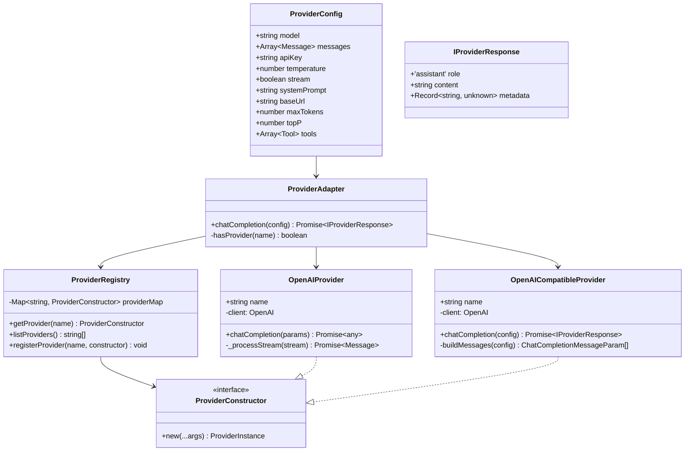

# Módulo Providers - Integração Unificada com LLMs

O módulo **Providers** é responsável pela integração unificada com diferentes provedores de modelos de linguagem, oferecendo uma interface consistente que abstrai as diferenças entre APIs e permite trocar provedores facilmente.

## Visão Geral

Este módulo resolve o problema fundamental de **inconsistência entre APIs de LLMs**, implementando um sistema de adaptadores que:

- **Interface Unificada**: API consistente independente do provedor
- **Múltiplos Provedores**: Suporte para OpenAI, provedores compatíveis, e extensível
- **Streaming**: Suporte nativo a respostas em tempo real
- **Configuração Flexível**: Sistema de configuração unificado via ProviderConfig
- **Registry**: Sistema de registro e descoberta de provedores
- **Tratamento de Erros**: Error handling padronizado entre provedores

## Arquitetura

### Componentes Principais

```
src/providers/
├── adapter/                           # Adaptador unificado
│   ├── providerAdapter.interface.ts   # Interfaces e contratos
│   ├── providerAdapter.ts            # Implementação do adaptador
│   └── index.ts                      # Exports do adaptador
├── providers/                         # Implementações específicas
│   ├── openAiProvider.ts             # Provedor OpenAI oficial
│   ├── openaiCompatibleProvider.ts   # Provedores compatíveis
│   ├── providerRegistry.ts           # Registry de provedores
│   └── index.ts                      # Exports dos provedores
├── utils/                            # Utilitários
│   ├── stream.ts                    # Utilitários de streaming
│   └── index.ts                     # Exports dos utilitários
└── index.ts                         # Exports principais
```

### Diagrama de Classes



## Interfaces e Contratos

### ProviderConfig
Configuração unificada para todos os provedores.

```typescript
interface ProviderConfig {
  // Parâmetros obrigatórios
  model: string;                    // Nome do modelo (ex: 'gpt-4', 'claude-3')
  messages: Array<{                 // Histórico de mensagens
    role: string;
    content: string;
  }>;
  apiKey: string;                   // Chave da API
  
  // Parâmetros opcionais com defaults
  temperature?: number;             // Criatividade (0.0 - 2.0)
  stream?: boolean;                 // Resposta em streaming
  systemPrompt?: string;            // Prompt do sistema
  
  // URL base para provedores compatíveis
  baseUrl?: string;                 // Obrigatório para openaiCompatible
  
  // Parâmetros avançados
  maxTokens?: number;               // Limite de tokens de resposta
  topP?: number;                    // Nucleus sampling
  
  // Ferramentas (passadas por prompt)
  tools?: Array<{
    name: string;
    description: string;
    parameters: any;
  }>;
}
```

### IProviderResponse
Resposta normalizada de qualquer provedor.

```typescript
interface IProviderResponse {
  role: 'assistant';               // Sempre 'assistant'
  content: string | null;          // Conteúdo gerado
  metadata?: Record<string, unknown>; // Metadados adicionais
}
```

## Implementações de Provedores

### OpenAIProvider
Provedor oficial da OpenAI com suporte completo a todos os recursos.

```typescript
class OpenAIProvider {
  name = 'openai';
  
  constructor(apiKey: string);
  
  async chatCompletion(
    chatHistory: Array<{ role: string; content: string }>,
    model: string,
    apiKey: string,
    temperature: number,
    useStream: boolean,
    systemPrompt: string,
    maxTokens?: number,
    topP?: number
  ): Promise<any>;
}
```

### OpenAICompatibleProvider
Para provedores que seguem a API da OpenAI (OpenRouter, Azure OpenAI, etc.).

```typescript
class OpenAICompatibleProvider {
  name = 'openaiCompatible';
  
  constructor(apiKey: string);
  
  async chatCompletion(config: ProviderConfig): Promise<IProviderResponse>;
}
```

### ProviderRegistry
Sistema de registro e descoberta de provedores.

```typescript
class ProviderRegistry {
  static getProvider(name: string): ProviderConstructor;
  static listProviders(): string[];
  static registerProvider(name: string, constructor: ProviderConstructor): void;
}
```

## Uso Básico

### Configuração Inicial

```typescript
import { ProviderAdapter, ProviderConfig } from '@/providers';

// Configuração básica
const config: ProviderConfig = {
  model: 'gpt-4',
  messages: [
    { role: 'user', content: 'Olá, como vai?' }
  ],
  apiKey: 'sua-api-key-aqui',
  temperature: 0.7
};

// Chamada simples
const response = await ProviderAdapter.chatCompletion(config);
console.log(response.content);
```

### Com System Prompt

```typescript
const config: ProviderConfig = {
  model: 'gpt-4',
  messages: [
    { role: 'user', content: 'Explique machine learning' }
  ],
  apiKey: 'sua-api-key',
  systemPrompt: 'Você é um especialista em IA. Seja claro e didático.',
  temperature: 0.3,
  maxTokens: 1000
};

const response = await ProviderAdapter.chatCompletion(config);
```

### Com Streaming

```typescript
const config: ProviderConfig = {
  model: 'gpt-4',
  messages: [
    { role: 'user', content: 'Conte uma história longa...' }
  ],
  apiKey: 'sua-api-key',
  stream: true
};

// Para streaming, a resposta será um iterador assíncrono
const response = await ProviderAdapter.chatCompletion(config);

for await (const chunk of response) {
  process.stdout.write(chunk.content);
}
```

## Provedores Específicos

### OpenAI Oficial

```typescript
import { OpenAIProvider } from '@/providers';

const provider = new OpenAIProvider('sua-api-key');

const response = await provider.chatCompletion(
  [
    { role: 'user', content: 'Olá!' }
  ],
  'gpt-4',
  'sua-api-key',
  0.7,
  false,
  'Você é um assistente útil.',
  1000
);
```

### OpenRouter (OpenAI Compatible)

```typescript
import { OpenAICompatibleProvider } from '@/providers';

const config: ProviderConfig = {
  model: 'meta-llama/llama-3.1-70b-instruct',
  messages: [
    { role: 'user', content: 'Explique quantum computing' }
  ],
  apiKey: 'sua-openrouter-api-key',
  baseUrl: 'https://openrouter.ai/api/v1',
  temperature: 0.5
};

const provider = new OpenAICompatibleProvider('sua-api-key');
const response = await provider.chatCompletion(config);
```

### Azure OpenAI

```typescript
const config: ProviderConfig = {
  model: 'gpt-4',
  messages: [
    { role: 'user', content: 'Olá!' }
  ],
  apiKey: 'sua-azure-api-key',
  baseUrl: 'https://seu-endpoint.openai.azure.com/',
  temperature: 0.7
};

const provider = new OpenAICompatibleProvider('sua-api-key');
const response = await provider.chatCompletion(config);
```

## Sistema de Registry

### Registrar Novo Provedor

```typescript
import { ProviderRegistry } from '@/providers';

class CustomProvider {
  name = 'custom';
  
  constructor(apiKey: string) {
    // Inicialização do provedor
  }
  
  async chatCompletion(config: ProviderConfig) {
    // Implementação customizada
    return {
      role: 'assistant',
      content: 'Resposta do provedor customizado',
      metadata: { provider: 'custom' }
    };
  }
}

// Registrar o provedor
ProviderRegistry.registerProvider('custom', CustomProvider);

// Usar o provedor registrado
const ProviderClass = ProviderRegistry.getProvider('custom');
const provider = new ProviderClass('api-key');
```

### Listar Provedores Disponíveis

```typescript
const providers = ProviderRegistry.listProviders();
console.log('Provedores disponíveis:', providers);
// ['openai', 'gpt', 'openaiCompatible']
```

## Integração com Outros Módulos

### Com Memory

```typescript
import { ProviderAdapter } from '@/providers';
import { ChatHistoryManager } from '@/memory';

const history = new ChatHistoryManager(config);
const messages = history.getTrimmedHistory();

const config: ProviderConfig = {
  model: 'gpt-4',
  messages,
  apiKey: 'sua-api-key',
  systemPrompt: 'Você é um assistente útil.'
};

const response = await ProviderAdapter.chatCompletion(config);
```

### Com PromptBuilder

```typescript
import { PromptBuilder } from '@/promptBuilder';
import { ProviderAdapter } from '@/providers';

const systemPrompt = PromptBuilder.buildSystemPrompt({
  mode: 'react',
  agentInfo: {
    name: 'Assistente IA',
    goal: 'Resolver problemas complexos',
    backstory: 'Especialista em reasoning'
  }
});

const config: ProviderConfig = {
  model: 'gpt-4',
  messages: [
    { role: 'user', content: userInput }
  ],
  apiKey: 'sua-api-key',
  systemPrompt
};

const response = await ProviderAdapter.chatCompletion(config);
```

### Com Agents

```typescript
import { AgentConfig } from '@/agent';
import { ProviderAdapter } from '@/providers';

const agentConfig: AgentConfig = {
  type: 'react',
  provider: 'openai',
  model: 'gpt-4',
  apiKey: 'sua-api-key'
};

const config: ProviderConfig = {
  model: agentConfig.model,
  messages: conversationHistory,
  apiKey: agentConfig.apiKey,
  systemPrompt: agentConfig.systemPrompt
};

const response = await ProviderAdapter.chatCompletion(config);
```

## Configuração Avançada

### Parâmetros de Modelagem

```typescript
const config: ProviderConfig = {
  model: 'gpt-4',
  messages: [...],
  apiKey: 'sua-api-key',
  
  // Controle de criatividade
  temperature: 0.7,        // 0.0 (determinístico) - 2.0 (criativo)
  topP: 0.9,              // Nucleus sampling
  
  // Limites
  maxTokens: 2000,        // Máximo de tokens na resposta
  
  // Streaming
  stream: false           // Resposta em tempo real
};
```

### Ferramentas (Tools)

```typescript
const config: ProviderConfig = {
  model: 'gpt-4',
  messages: [...],
  apiKey: 'sua-api-key',
  
  tools: [
    {
      name: 'search',
      description: 'Busca informações na web',
      parameters: {
        type: 'object',
        properties: {
          query: { type: 'string' }
        }
      }
    }
  ]
};
```

## Tratamento de Erros

### Error Handling Básico

```typescript
try {
  const response = await ProviderAdapter.chatCompletion(config);
  console.log('Resposta:', response.content);
} catch (error) {
  if (error.message.includes('API key')) {
    console.error('Erro de autenticação: verifique sua API key');
  } else if (error.message.includes('rate limit')) {
    console.error('Rate limit excedido: tente novamente em alguns minutos');
  } else {
    console.error('Erro desconhecido:', error.message);
  }
}
```

### Retry com Backoff

```typescript
async function callWithRetry(config: ProviderConfig, maxRetries = 3): Promise<any> {
  for (let attempt = 1; attempt <= maxRetries; attempt++) {
    try {
      return await ProviderAdapter.chatCompletion(config);
    } catch (error) {
      if (attempt === maxRetries) {
        throw error;
      }
      
      // Backoff exponencial
      const delay = Math.pow(2, attempt) * 1000;
      console.log(`Tentativa ${attempt} falhou, retry em ${delay}ms`);
      await new Promise(resolve => setTimeout(resolve, delay));
    }
  }
}
```

## Testes

O módulo possui cobertura de testes para todos os componentes:

```bash
# Executar testes específicos do módulo providers
npm test -- --testPathPattern=providers

# Executar com cobertura
npm run test:coverage -- --coverageDirectory=coverage/providers
```

### Casos de Teste Principais

- ✅ ProviderAdapter com diferentes configurações
- ✅ OpenAIProvider com streaming e sem streaming
- ✅ OpenAICompatibleProvider com baseUrl customizada
- ✅ ProviderRegistry com registro e descoberta
- ✅ Tratamento de erros e fallbacks
- ✅ Validação de configurações
- ✅ Conversão de formatos de mensagem

## Boas Práticas

### 1. Configuração de API Keys
```typescript
// ✅ Bom: Usar variáveis de ambiente
const apiKey = process.env.OPENAI_API_KEY;

// ❌ Ruim: Hardcode da chave
const apiKey = 'sk-1234567890abcdef...';
```

### 2. Tratamento de Erros
```typescript
// ✅ Bom: Tratamento específico por tipo de erro
try {
  const response = await ProviderAdapter.chatCompletion(config);
} catch (error) {
  if (error.status === 401) {
    // Erro de autenticação
  } else if (error.status === 429) {
    // Rate limit
  } else {
    // Erro genérico
  }
}

// ❌ Ruim: Catch genérico sem tratamento
try {
  const response = await ProviderAdapter.chatCompletion(config);
} catch (error) {
  console.error('Erro:', error);
}
```

### 3. Configuração de Modelos
```typescript
// ✅ Bom: Configuração específica por caso de uso
const chatConfig = {
  model: 'gpt-3.5-turbo',  // Mais rápido e barato para chat
  temperature: 0.7
};

const creativeConfig = {
  model: 'gpt-4',          // Mais capaz para tarefas complexas
  temperature: 0.9
};

// ❌ Ruim: Usar sempre o mesmo modelo
const config = { model: 'gpt-4' };
```

### 4. Gerenciamento de Contexto
```typescript
// ✅ Bom: Usar o sistema de memória
const history = new ChatHistoryManager(config);
history.addMessage(userMessage);
const messages = history.getTrimmedHistory();

// ❌ Ruim: Manter histórico manualmente
const messages = [...previousMessages, userMessage];
```

## Configuração por Provedor

### OpenAI

```typescript
const openaiConfig: ProviderConfig = {
  model: 'gpt-4',
  messages: [...],
  apiKey: process.env.OPENAI_API_KEY!,
  temperature: 0.7,
  maxTokens: 2000
};
```

### OpenRouter

```typescript
const openrouterConfig: ProviderConfig = {
  model: 'meta-llama/llama-3.1-70b-instruct',
  messages: [...],
  apiKey: process.env.OPENROUTER_API_KEY!,
  baseUrl: 'https://openrouter.ai/api/v1',
  temperature: 0.5
};
```

### Azure OpenAI

```typescript
const azureConfig: ProviderConfig = {
  model: 'gpt-4',
  messages: [...],
  apiKey: process.env.AZURE_OPENAI_API_KEY!,
  baseUrl: process.env.AZURE_OPENAI_ENDPOINT!,
  temperature: 0.7
};
```

## Limitações Conhecidas

1. **Rate Limits**: Cada provedor tem limites diferentes
2. **Model Availability**: Nem todos os modelos estão disponíveis em todos os provedores
3. **Pricing**: Custos variam significativamente entre provedores
4. **Features**: Nem todos os recursos estão disponíveis em todos os provedores

## Troubleshooting

### Problema: "API key inválida"
**Causa**: Chave de API incorreta ou expirada
**Solução**:
```typescript
// Verificar se a chave está correta
console.log('API Key length:', apiKey.length);
console.log('API Key prefix:', apiKey.substring(0, 7));
```

### Problema: "Model não encontrado"
**Causa**: Nome do modelo incorreto ou não disponível
**Solução**:
```typescript
// Verificar modelos disponíveis do provedor
const providers = ProviderRegistry.listProviders();
console.log('Provedores disponíveis:', providers);
```

### Problema: "Rate limit excedido"
**Causa**: Muitas requisições em pouco tempo
**Solução**:
```typescript
// Implementar rate limiting
const rateLimiter = new RateLimiter({
  maxRequests: 10,
  timeWindow: 60000 // 1 minuto
});
```

### Problema: "BaseUrl obrigatória"
**Causa**: Esquecer baseUrl para provedores compatíveis
**Solução**:
```typescript
// Para OpenAI Compatible, baseUrl é obrigatória
const config: ProviderConfig = {
  // ...
  baseUrl: 'https://api.openai.com/v1', // Obrigatório
  // ...
};
```

## Roadmap

- [ ] Suporte a Anthropic Claude
- [ ] Suporte a Google Gemini
- [ ] Suporte a modelos locais (Ollama, LM Studio)
- [ ] Sistema de fallback automático entre provedores
- [ ] Métricas de performance por provedor
- [ ] Cache de respostas
- [ ] Load balancing entre múltiplos provedores

## Contribuindo

Para contribuir com este módulo:

1. Mantenha compatibilidade com ProviderConfig
2. Adicione testes para novos provedores
3. Atualize documentação JSDoc
4. Siga padrões de error handling
5. Teste com diferentes configurações

## Licença

Este módulo é parte do frame-agent-sdk e segue a mesma licença do projeto principal.

### OpenAICompatibleProvider
- **Localização**: [`providers/openaiCompatibleProvider.ts`](providers/openaiCompatibleProvider.ts)
- **Função**: Para provedores que seguem a API da OpenAI
- **Características**:
  - Compatibilidade com múltiplos provedores
  - Configuração de baseURL customizada
  - Suporte a diferentes formatos de resposta

### ProviderRegistry
- **Localização**: [`providers/providerRegistry.ts`](providers/providerRegistry.ts)
- **Função**: Registro centralizado de provedores
- **Características**:
  - Registro dinâmico de provedores
  - Descoberta automática de provedores
  - Gerenciamento de instâncias

## Exemplos de Uso

### Configuração Básica
```typescript
import { ProviderAdapter } from './providers';

// Configurar OpenAI
const openaiProvider = new ProviderAdapter({
  provider: 'openai',
  model: 'gpt-4o-mini',
  apiKey: process.env.OPENAI_API_KEY,
  temperature: 0.7,
  maxTokens: 1000
});

// Configurar provedor compatível
const compatibleProvider = new ProviderAdapter({
  provider: 'openai-compatible',
  model: 'custom-model',
  baseURL: 'https://api.custom-provider.com/v1',
  apiKey: process.env.CUSTOM_API_KEY,
  temperature: 0.8
});
```

### Invocação Simples
```typescript
import { ProviderAdapter } from './providers';
import type { Message } from '../memory';

const messages: Message[] = [
  { role: 'system', content: 'Você é um assistente prestativo.' },
  { role: 'user', content: 'Explique a teoria da relatividade.' }
];

// Invocar provedor
const response = await openaiProvider.invoke({ messages });

// Com opções adicionais
const response = await openaiProvider.invoke({
  messages,
  temperature: 0.8,
  maxTokens: 500,
  tools: [...], // Ferramentas disponíveis
  stream: false
});
```

### Streaming de Respostas
```typescript
import { ProviderAdapter } from './providers';

// Streaming com OpenAI
const stream = await openaiProvider.stream({ messages });

for await (const chunk of stream) {
  process.stdout.write(chunk.content);
}

// Streaming com callbacks
await openaiProvider.stream({ 
  messages,
  onChunk: (chunk) => {
  },
  onComplete: (fullResponse) => {
  }
});
```

### Uso com Ferramentas
```typescript
import { ProviderAdapter } from './providers';
import { SearchTool, CalculatorTool } from '../tools';

const tools = [
  new SearchTool(),
  new CalculatorTool()
];

const response = await openaiProvider.invoke({
  messages: [
    { role: 'user', content: 'Qual é a população de Tóquio e qual a raiz quadrada dela?' }
  ],
  tools: tools,
  tool_choice: 'auto' // Deixar o modelo escolher quando usar ferramentas
});

// Verificar se ferramentas foram usadas
if (response.tool_calls) {
  
  // Executar ferramentas
  for (const toolCall of response.tool_calls) {
    const tool = tools.find(t => t.name === toolCall.name);
    if (tool) {
      const toolResult = await tool.execute(toolCall.arguments);
    }
  }
}
```

### Retry Automático e Tratamento de Erros
```typescript
import { ProviderAdapter } from './providers';

const provider = new ProviderAdapter({
  provider: 'openai',
  model: 'gpt-4o-mini',
  retries: 3,        // Tentar até 3 vezes
  retryDelay: 1000,  // Esperar 1 segundo entre tentativas
  exponentialBackoff: true, // Backoff exponencial
  timeout: 30000     // Timeout de 30 segundos
});

try {
  const response = await provider.invoke({ messages });
} catch (error) {
  if (error.name === 'ProviderTimeoutError') {
    console.error('Timeout - a operação demorou muito');
  } else if (error.name === 'ProviderRateLimitError') {
    console.error('Limite de taxa excedido');
  } else if (error.name === 'ProviderAuthenticationError') {
    console.error('Problema de autenticação - verificar API key');
  } else {
    console.error('Erro no provedor:', error.message);
  }
}
```

### Registro de Provedores Customizados
```typescript
import { ProviderRegistry } from './providers';

// Registrar provedor customizado
ProviderRegistry.register('meu-provedor', {
  name: 'Meu Provedor',
  baseURL: 'https://api.meu-provedor.com/v1',
  models: ['modelo-1', 'modelo-2', 'modelo-3'],
  features: ['streaming', 'tools', 'batch'],
  headers: {
    'X-Custom-Header': 'valor'
  }
});

// Usar provedor registrado
const customProvider = new ProviderAdapter({
  provider: 'meu-provedor',
  model: 'modelo-1',
  apiKey: process.env.MEU_PROVEDOR_API_KEY
});
```

### Provedores Múltiplos com Failover
```typescript
import { ProviderAdapter } from './providers';

const providers = [
  new ProviderAdapter({
    provider: 'openai',
    model: 'gpt-4o-mini',
    apiKey: process.env.OPENAI_API_KEY,
    priority: 1
  }),
  new ProviderAdapter({
    provider: 'openai-compatible',
    model: 'backup-model',
    baseURL: 'https://api.backup-provider.com/v1',
    apiKey: process.env.BACKUP_API_KEY,
    priority: 2
  })
];

// Implementar failover
async function invokeWithFailover(messages: Message[]) {
  for (const provider of providers.sort((a, b) => a.priority - b.priority)) {
    try {
      const response = await provider.invoke({ messages });
      return response;
    } catch (error) {
      console.warn(`Falha com ${provider.provider}:`, error.message);
      continue;
    }
  }
  throw new Error('Todos os provedores falharam');
}
```

## Configurações Avançadas

### Configuração de Timeout e Retry
```typescript
import { ProviderAdapter } from './providers';

const provider = new ProviderAdapter({
  provider: 'openai',
  model: 'gpt-4o-mini',
  timeout: 60000,     // 1 minuto
  retries: 5,         // 5 tentativas
  retryDelay: 2000,   // 2 segundos entre tentativas
  exponentialBackoff: true,
  maxRetryDelay: 30000 // Máximo 30 segundos entre tentativas
});
```

### Parâmetros do Modelo
```typescript
import { ProviderAdapter } from './providers';

const response = await provider.invoke({
  messages,
  temperature: 0.8,      // Criatividade (0-2)
  top_p: 0.9,           // Nucleus sampling
  frequency_penalty: 0.5, // Penalidade de frequência
  presence_penalty: 0.5,  // Penalidade de presença
  stop: ['\n', '.'],     // Sequências de parada
  maxTokens: 1000,       // Máximo de tokens
  seed: 42,              // Seed para reprodutibilidade
  logprobs: 10,          // Log probabilities
  top_logprobs: 5        // Top log probabilities
});
```

### Streaming Avançado
```typescript
import { ProviderAdapter } from './providers';

const stream = await provider.stream({ 
  messages,
  onChunk: (chunk) => {
    // Processar cada chunk
    if (chunk.usage) {
  },
  onComplete: (fullResponse) => {
    // Chamado quando o streaming termina
  },
  onError: (error) => {
    // Tratar erros durante o streaming
    console.error('Erro no streaming:', error);
  },
  streamOptions: {
    include_usage: true,    // Incluir informações de uso
    include_logprobs: true  // Incluir log probabilities
  }
});
```

### Headers e Configurações Customizadas
```typescript
import { ProviderAdapter } from './providers';

const provider = new ProviderAdapter({
  provider: 'openai-compatible',
  model: 'custom-model',
  baseURL: 'https://api.custom-provider.com/v1',
  apiKey: process.env.CUSTOM_API_KEY,
  headers: {
    'X-Custom-Header': 'valor',
    'X-Organization': 'minha-org'
  },
  queryParams: {
    custom_param: 'valor'
  },
  requestConfig: {
    httpsAgent: customAgent, // Agent HTTPS customizado
    proxy: {
      host: 'proxy.example.com',
      port: 8080
    }
  }
});
```

## Integração com Outros Módulos

### LLM
O módulo LLM usa ProviderAdapter internamente:
```typescript
// Internamente, LLM usa ProviderAdapter
import { ProviderAdapter } from '../providers';

const provider = new ProviderAdapter({
  provider: options.provider,
  model: options.model,
  apiKey: options.apiKey
});

// O ProviderAdapter lida com as especificidades de cada provedor
```

### Agents
Agentes usam provedores através do LLM:
```typescript
import { ProviderAdapter } from '../providers';
import { LLM } from '../llm';

class MeuAgente {
  constructor(private config: IAgentConfig) {
    this.llm = new LLM({
      provider: config.provider,
      model: config.model,
      apiKey: config.apiKey
    });
  }
}
```

### Workflows
Workflows podem usar provedores diretamente:
```typescript
import { ProviderAdapter } from '../providers';

const step = {
  id: 'llm-processing',
  execute: async (context) => {
    const provider = new ProviderAdapter({
      provider: 'openai',
      model: 'gpt-4o-mini',
      apiKey: context.secrets.OPENAI_API_KEY
    });
    
    const response = await provider.invoke({
      messages: context.data.messages
    });
    
    return response.content;
  }
};
```

## Tratamento de Erros

### Tipos de Erros
```typescript
import { ProviderAdapter } from './providers';

try {
  const response = await provider.invoke({ messages });
} catch (error) {
  switch (error.name) {
    case 'ProviderTimeoutError':
      // Timeout - considerar aumentar timeout ou simplificar prompt
      break;
    case 'ProviderRateLimitError':
      // Rate limit - implementar backoff exponencial
      break;
    case 'ProviderAuthenticationError':
      // Problema de autenticação - verificar API key
      break;
    case 'ProviderValidationError':
      // Parâmetros inválidos - verificar configuração
      break;
    case 'ProviderServerError':
      // Erro do servidor - tentar novamente mais tarde
      break;
    default:
      console.error('Erro desconhecido:', error);
  }
}
```

## Performance e Otimização

### Reutilização de Instâncias
```typescript
// Criar uma vez, reutilizar múltiplas vezes
const provider = new ProviderAdapter({
  provider: 'openai',
  model: 'gpt-4o-mini'
});

// Reutilizar em múltiplas chamadas
const response1 = await provider.invoke({ messages: messages1 });
const response2 = await provider.invoke({ messages: messages2 });
```

### Connection Pooling
```typescript
import { ProviderAdapter } from './providers';

const provider = new ProviderAdapter({
  provider: 'openai',
  model: 'gpt-4o-mini',
  connectionPool: {
    enabled: true,
    maxConnections: 10,
    keepAlive: true,
    timeout: 30000
  }
});
```

### Cache de Respostas
```typescript
import { ProviderAdapter } from './providers';

const provider = new ProviderAdapter({
  provider: 'openai',
  model: 'gpt-4o-mini',
  cache: {
    enabled: true,
    ttl: 3600000, // 1 hora
    maxSize: 1000,
    keyGenerator: (messages) => {
      return JSON.stringify(messages);
    }
  }
});
```

## Documentação Adicional

- [API Reference](../../docs/api/modules/providers.md)
- [Exemplos de Provedores](../../examples/providers/)
- [Guia de Configuração](./configuration.md)
- [Integração com LLM](../llm/README.md)

## Notas Importantes

1. **API Keys Seguras**: Sempre use variáveis de ambiente para API keys
2. **Rate Limiting**: Respeite os limites de cada provedor
3. **Timeouts Apropriados**: Configure baseado no uso esperado
4. **Retry com Cuidado**: Muitas tentativas podem aumentar custos
5. **Streaming para UX**: Use streaming para melhor experiência do usuário
6. **Provedores Compatíveis**: Verifique compatibilidade antes de usar
7. **Headers Customizados**: Use apenas quando necessário
8. **Monitoramento**: Monitore uso e custos regularmente