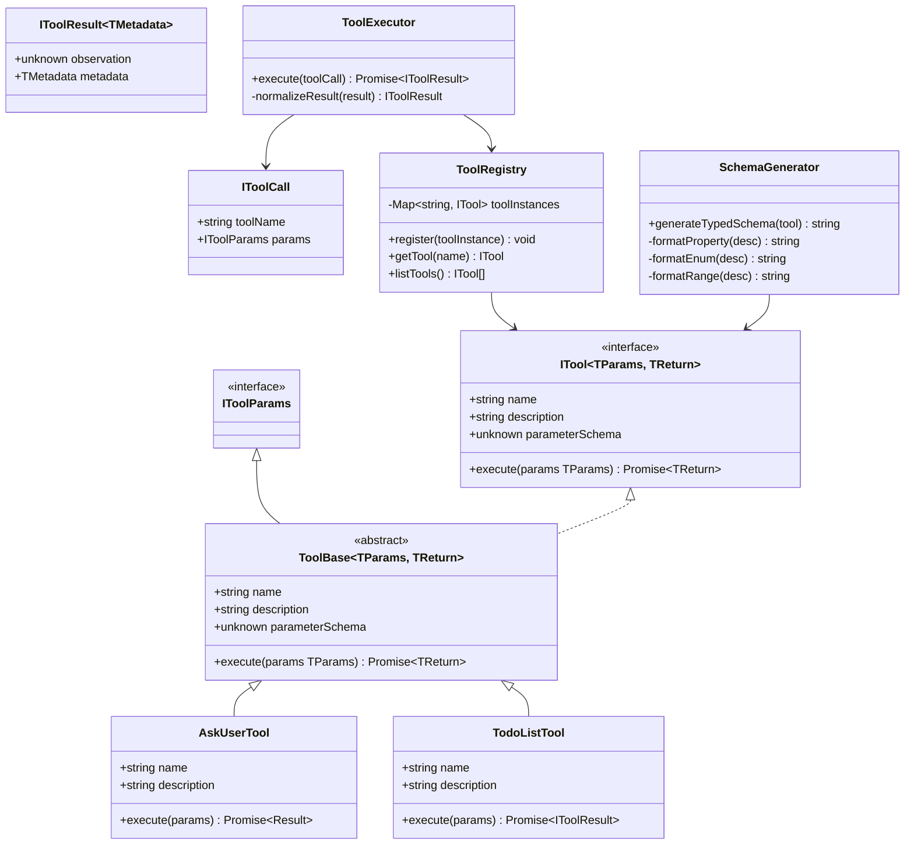

# Módulo Tools - Sistema Completo de Ferramentas para Agentes de IA

O módulo **Tools** é responsável pelo sistema completo de ferramentas que permite que agentes de IA executem ações no mundo real, interajam com usuários e gerenciem estados complexos de forma estruturada e tipada.

## Visão Geral

Este módulo resolve o problema fundamental de **execução de ações por agentes de IA**, implementando um sistema robusto que:

- **Ferramentas Tipadas**: Sistema de ferramentas com validação de tipos TypeScript
- **Schema Aligned Parsing (SAP)**: Geração automática de schemas para LLMs
- **Registry Centralizado**: Sistema de registro e descoberta de ferramentas
- **Execução Segura**: Executor com tratamento de erros e logging
- **Ferramentas Prontas**: Conjunto de ferramentas úteis para casos comuns
- **Integração LLM**: Conversão automática entre formatos MCP e SAP
- **Metadados Estruturados**: Suporte a metadados para atualização de estado

## Arquitetura

### Componentes Principais

```
src/tools/
├── constructor/                     # Construtores e utilitários
│   ├── toolBase.ts                 # Classe base para ferramentas
│   ├── schemaGenerator.ts          # Gerador de schemas para LLMs
│   ├── mcpToSapConverter.ts        # Conversor MCP → SAP
│   ├── sapToMcpConverter.ts        # Conversor SAP → MCP
│   ├── sapParser.ts               # Parser para schemas SAP
│   └── index.ts                   # Exports do constructor
├── core/                          # Núcleo do sistema
│   ├── interfaces.ts              # Interfaces e tipos principais
│   ├── toolRegistry.ts            # Registry de ferramentas
│   ├── toolExecutor.ts            # Executor de ferramentas
│   ├── toolValidator.ts           # Validador de ferramentas
│   ├── toolDetector.ts            # Detector de ferramentas
│   └── index.ts                   # Exports do core
├── tools/                         # Ferramentas prontas
│   ├── askUserTool.ts             # Solicitar input do usuário
│   ├── finalAnswerTool.ts         # Resposta final do agente
│   ├── todoListTool.ts            # Gerenciamento de tarefas
│   ├── approvalTool.ts            # Sistema de aprovação
│   ├── mcp/                       # Ferramentas MCP
│   └── index.ts                   # Exports das tools
└── index.ts                       # Exports principais
```

### Diagrama de Classes



## Interfaces e Contratos

### IToolParams
Interface vazia que serve como base para todas as classes de parâmetros.

```typescript
interface IToolParams {}
```

### IToolResult
Resultado estruturado de uma execução de ferramenta.

```typescript
interface IToolResult<TMetadata = Record<string, unknown>> {
  observation: unknown;           // Resultado principal
  metadata?: TMetadata;           // Metadados para atualizar estado
}
```

### ITool
Contrato principal para definição de ferramentas.

```typescript
interface ITool<TParams extends IToolParams = IToolParams, TReturn = unknown> {
  name: string;                   // Nome único da ferramenta
  description: string;            // Descrição para o LLM
  readonly parameterSchema: unknown; // Schema dos parâmetros
  execute(params: TParams): Promise<TReturn>; // Método de execução
}
```

### IToolCall
Estrutura para chamada de ferramenta.

```typescript
interface IToolCall {
  toolName: string;               // Nome da ferramenta
  params: IToolParams;            // Parâmetros tipados
}
```

## Sistema de Ferramentas

### ToolBase
Classe base abstrata para todas as ferramentas.

```typescript
abstract class ToolBase<TParams extends IToolParams = IToolParams, TReturn = unknown>
  implements ITool<TParams, TReturn> {
  public abstract readonly name: string;
  public abstract readonly description: string;
  public abstract readonly parameterSchema: unknown;
  public abstract execute(params: TParams): Promise<TReturn>;
}
```

### ToolRegistry
Registry centralizado para gerenciamento de ferramentas.

```typescript
class ToolRegistry {
  register(toolInstance: ITool<IToolParams, unknown>): void;
  getTool(name: string): ITool<IToolParams, unknown> | undefined;
  listTools(): ITool<IToolParams, unknown>[];
}
```

### ToolExecutor
Executor centralizado com tratamento de erros.

```typescript
class ToolExecutor {
  static async execute(toolCall: IToolCall): Promise<IToolResult>;
  private static normalizeResult(result: unknown): IToolResult;
}
```

## Schema Aligned Parsing (SAP)

O sistema SAP permite que ferramentas TypeScript sejam automaticamente convertidas em schemas que LLMs podem entender e usar.

### SchemaGenerator
Converte parameterSchema para formato legível por LLMs.

```typescript
class SchemaGenerator {
  static generateTypedSchema(tool: ITool): string;
  private static formatProperty(desc: PropertyDescriptor): string;
  private static formatEnum(desc: PropertyDescriptor): string;
  private static formatRange(desc: PropertyDescriptor): string;
}
```

### Exemplo de Conversão

**Input (TypeScript):**
```typescript
class SearchParams {
  query!: string;
  maxResults?: number;
  category?: 'news' | 'academic' | 'general';
}
```

**Output (Schema para LLM):**
```typescript
class SearchParams = {
  query: string; // Required
  maxResults?: number; // Optional, range: min=1, max=100
  category?: string; // Optional, enum: news, academic, general
}
```

## Ferramentas Prontas

### AskUserTool
Solicita input do usuário quando necessário.

```typescript
class AskUserParams implements IToolParams {
  question!: string;              // Pergunta obrigatória
  details?: string;               // Detalhes opcionais
}

class AskUserTool extends ToolBase<AskUserParams, AskUserResult> {
  name = 'ask_user';
  description = 'Pede esclarecimentos ao usuário quando informações adicionais são necessárias.';
}
```

### TodoListTool
Gerencia listas de tarefas com status.

```typescript
class TodoListParams implements IToolParams {
  action!: 'create' | 'add' | 'update_status' | 'complete_all' | 'delete_task' | 'delete_list';
  title?: string;
  id?: string;
  status?: 'pending' | 'in_progress' | 'completed';
  tasks?: string[];
}

class TodoListTool extends ToolBase<TodoListParams, IToolResult<TodoListMetadata>> {
  name = 'todo_list';
  description = 'Gerencia uma lista de tarefas com status em inglês.';
}
```

### FinalAnswerTool
Finaliza a conversa com uma resposta.

```typescript
class FinalAnswerParams implements IToolParams {
  answer!: string;                // Resposta final
  confidence?: number;            // Nível de confiança (0-1)
  sources?: string[];             // Fontes consultadas
}
```

## Uso Básico

### Criando uma Ferramenta Personalizada

```typescript
import { ToolBase } from '@/tools/constructor/toolBase';
import type { IToolParams, IToolResult } from '@/tools/core/interfaces';

// 1. Definir classe de parâmetros
export class CalculatorParams implements IToolParams {
  operation!: 'add' | 'subtract' | 'multiply' | 'divide';
  a!: number;
  b!: number;
}

// 2. Implementar a ferramenta
export class CalculatorTool extends ToolBase<CalculatorParams, IToolResult> {
  public readonly name = 'calculator';
  public readonly description = 'Realiza operações matemáticas básicas.';
  public readonly parameterSchema = CalculatorParams;

  public async execute(params: CalculatorParams): Promise<IToolResult> {
    let result: number;
    
    switch (params.operation) {
      case 'add':
        result = params.a + params.b;
        break;
      case 'subtract':
        result = params.a - params.b;
        break;
      case 'multiply':
        result = params.a * params.b;
        break;
      case 'divide':
        if (params.b === 0) {
          throw new Error('Divisão por zero não é permitida');
        }
        result = params.a / params.b;
        break;
    }

    return {
      observation: `Resultado: ${result}`,
      metadata: { lastCalculation: result }
    };
  }
}
```

### Registrando e Usando Ferramentas

```typescript
import { toolRegistry } from '@/tools/core/toolRegistry';
import { ToolExecutor } from '@/tools/core/toolExecutor';

// Registrar ferramenta
const calculator = new CalculatorTool();
toolRegistry.register(calculator);

// Executar ferramenta
const toolCall = {
  toolName: 'calculator',
  params: {
    operation: 'add',
    a: 10,
    b: 5
  }
};

const result = await ToolExecutor.execute(toolCall);
console.log(result.observation); // "Resultado: 15"
```

### Gerando Schema para LLM

```typescript
import { generateTypedSchema } from '@/tools/constructor/schemaGenerator';

// Gerar schema para o PromptBuilder
const schema = generateTypedSchema(calculator);
console.log(schema);
/*
class CalculatorParams = {
  operation: string; // Required, enum: add, subtract, multiply, divide
  a: number; // Required
  b: number; // Required
}
*/
```

## Integração com Outros Módulos

### Com PromptBuilder

```typescript
import { PromptBuilder } from '@/promptBuilder';
import { toolRegistry } from '@/tools/core/toolRegistry';

// Registrar ferramentas
toolRegistry.register(new CalculatorTool());
toolRegistry.register(new AskUserTool());

// Construir prompt com tools
const prompt = PromptBuilder.buildSystemPrompt({
  mode: 'react',
  agentInfo: {
    name: 'Assistente Matemático',
    goal: 'Resolver problemas matemáticos',
    backstory: 'Especialista em cálculos'
  },
  toolNames: ['calculator', 'ask_user']
});
```

### Com Providers

```typescript
import { ProviderAdapter } from '@/providers';
import { ToolExecutor } from '@/tools/core/toolExecutor';

// Simular chamada de ferramenta pelo LLM
const toolCall = {
  toolName: 'calculator',
  params: {
    operation: 'multiply',
    a: 7,
    b: 8
  }
};

// Executar ferramenta
const result = await ToolExecutor.execute(toolCall);

// Incluir resultado na próxima chamada ao LLM
const response = await ProviderAdapter.chatCompletion({
  model: 'gpt-4',
  messages: [
    { role: 'user', content: userInput },
    { role: 'assistant', content: `Usei a ferramenta calculator: ${result.observation}` },
    { role: 'user', content: 'Continue...' }
  ],
  apiKey: 'sua-api-key'
});
```

### Com Agents

```typescript
import { AgentConfig } from '@/agent';
import { toolRegistry } from '@/tools/core/toolRegistry';

const agentConfig: AgentConfig = {
  type: 'react',
  name: 'Assistente IA',
  goal: 'Resolver problemas complexos',
  tools: ['calculator', 'todo_list', 'ask_user']
};

// Registrar tools para o agente
agentConfig.tools.forEach(toolName => {
  const tool = toolRegistry.getTool(toolName);
  if (tool) {
    toolRegistry.register(tool);
  }
});
```

## Validação e Segurança

### ToolValidator
Validação de ferramentas e parâmetros.

```typescript
class ToolValidator {
  static validateTool(tool: ITool): ValidationResult;
  static validateParams(params: IToolParams, schema: unknown): ValidationResult;
  static validateCall(toolCall: IToolCall): ValidationResult;
}
```

### Tratamento de Erros

```typescript
try {
  const result = await ToolExecutor.execute(toolCall);
  console.log('Sucesso:', result.observation);
} catch (error) {
  if (error.message.includes('Ferramenta não encontrada')) {
    console.error('Tool não registrada:', error.message);
  } else if (error.message.includes('Parâmetros inválidos')) {
    console.error('Parâmetros incorretos:', error.message);
  } else {
    console.error('Erro na execução:', error.message);
  }
}
```

## Configuração Avançada

### Metadados Personalizados

```typescript
interface CustomMetadata {
  calculationHistory: number[];
  userPreferences: Record<string, any>;
}

class CalculatorTool extends ToolBase<CalculatorParams, IToolResult<CustomMetadata>> {
  public async execute(params: CalculatorParams): Promise<IToolResult<CustomMetadata>> {
    const result = /* ... cálculo ... */;
    
    return {
      observation: `Resultado: ${result}`,
      metadata: {
        calculationHistory: [result],
        userPreferences: { precision: 2 }
      }
    };
  }
}
```

### Ferramentas Assíncronas

```typescript
class WebSearchTool extends ToolBase<SearchParams, IToolResult<SearchMetadata>> {
  public async execute(params: SearchParams): Promise<IToolResult<SearchMetadata>> {
    // Simular busca assíncrona
    const results = await this.performSearch(params.query);
    
    return {
      observation: `Encontrados ${results.length} resultados`,
      metadata: {
        searchResults: results,
        query: params.query,
        timestamp: Date.now()
      }
    };
  }
  
  private async performSearch(query: string): Promise<SearchResult[]> {
    // Implementação da busca
    return [];
  }
}
```

## Testes

O módulo possui cobertura de testes para todos os componentes:

```bash
# Executar testes específicos do módulo tools
npm test -- --testPathPattern=tools

# Executar com cobertura
npm run test:coverage -- --coverageDirectory=coverage/tools
```

### Casos de Teste Principais

- ✅ Criação e registro de ferramentas personalizadas
- ✅ Execução de ferramentas com diferentes tipos de parâmetros
- ✅ Geração de schemas para LLMs
- ✅ Validação de parâmetros e ferramentas
- ✅ Tratamento de erros e edge cases
- ✅ Registry de ferramentas (registro, descoberta, listagem)
- ✅ Conversão entre formatos MCP e SAP

## Boas Práticas

### 1. Nomenclatura de Ferramentas
```typescript
// ✅ Bom: Nomes descritivos e em snake_case
const toolNames = [
  'calculate_bmi',
  'search_web',
  'send_email',
  'create_file'
];

// ❌ Ruim: Nomes genéricos ou ambíguos
const toolNames = [
  'calc',      // Ambíguo
  'search',    // Muito genérico
  'do_action'  // Não descritivo
];
```

### 2. Descrições para LLMs
```typescript
// ✅ Bom: Descrição específica e acionável
public readonly description = `
  Calcula o Índice de Massa Corporal (IMC) baseado em peso e altura.
  Retorna o valor do IMC e a categoria correspondente (baixo peso, normal, sobrepeso, obesidade).
  Use quando precisar avaliar o peso de uma pessoa em relação à sua altura.
`;

// ❌ Ruim: Descrição vaga
public readonly description = 'Calcula IMC';
```

### 3. Validação de Parâmetros
```typescript
// ✅ Bom: Validação explícita
public async execute(params: CalculatorParams): Promise<IToolResult> {
  if (params.operation === 'divide' && params.b === 0) {
    throw new Error('Divisão por zero não é permitida');
  }
  
  if (params.a < 0 || params.b < 0) {
    throw new Error('Números negativos não são suportados');
  }
  
  // ... execução ...
}

// ❌ Ruim: Sem validação
public async execute(params: CalculatorParams): Promise<IToolResult> {
  const result = eval(`${params.a} ${params.operation} ${params.b}`); // Perigoso!
  return { observation: result };
}
```

### 4. Metadados Estruturados
```typescript
// ✅ Bom: Metadados tipados e úteis
interface CalculatorMetadata {
  lastCalculation: number;
  calculationHistory: number[];
  precision: number;
}

// ❌ Ruim: Metadados genéricos
interface GenericMetadata {
  data: any; // Não tipado
}
```

## Configuração por Caso de Uso

### Agente de Produtividade

```typescript
// Ferramentas para produtividade
const productivityTools = [
  new TodoListTool(),
  new CalendarTool(),
  new EmailTool(),
  new FileManagerTool()
];

productivityTools.forEach(tool => toolRegistry.register(tool));
```

### Agente de Pesquisa

```typescript
// Ferramentas para pesquisa
const researchTools = [
  new WebSearchTool(),
  new AcademicSearchTool(),
  new DataAnalyzerTool(),
  new CitationTool()
];

researchTools.forEach(tool => toolRegistry.register(tool));
```

### Agente de Desenvolvimento

```typescript
// Ferramentas para desenvolvimento
const devTools = [
  new CodeAnalyzerTool(),
  new TestRunnerTool(),
  new GitTool(),
  new DeploymentTool()
];

devTools.forEach(tool => toolRegistry.register(tool));
```

## Limitações Conhecidas

1. **Validação de Schema**: Validação básica, pode ser extendida
2. **Performance**: Execução síncrona de tools (pode ser otimizada)
3. **Error Recovery**: Recuperação limitada de erros
4. **Concurrency**: Sem suporte a execução concorrente

## Troubleshooting

### Problema: "Ferramenta não encontrada"
**Causa**: Ferramenta não foi registrada no ToolRegistry
**Solução**:
```typescript
// Verificar se a ferramenta está registrada
const tool = toolRegistry.getTool('tool_name');
if (!tool) {
  console.error('Ferramenta não encontrada:', 'tool_name');
  toolRegistry.register(new MinhaTool());
}
```

### Problema: "Parâmetros inválidos"
**Causa**: Schema não corresponde aos parâmetros fornecidos
**Solução**:
```typescript
// Validar parâmetros antes da execução
const validation = ToolValidator.validateParams(params, tool.parameterSchema);
if (!validation.isValid) {
  console.error('Parâmetros inválidos:', validation.errors);
}
```

### Problema: "Schema generation falha"
**Causa**: Estrutura de classe incompatível
**Solução**:
```typescript
// Usar schema manual como fallback
public readonly parameterSchema = `
  class CustomParams = {
    param1: string; // Required
    param2?: number; // Optional
  }
`;
```

## Roadmap

- [ ] Suporte a ferramentas assíncronas com timeout
- [ ] Sistema de plugins para ferramentas externas
- [ ] Cache de resultados de ferramentas
- [ ] Ferramentas de monitoramento e métricas
- [ ] Sistema de permissions para ferramentas
- [ ] Suporte a ferramentas com estado persistente
- [ ] Interface visual para criação de ferramentas

## Contribuindo

Para contribuir com este módulo:

1. Mantenha compatibilidade com ITool interface
2. Adicione testes para novas ferramentas
3. Atualize documentação JSDoc
4. Siga padrões de nomenclatura estabelecidos
5. Implemente validação adequada de parâmetros

## Licença

Este módulo é parte do frame-agent-sdk e segue a mesma licença do projeto principal.
- **Função**: Registro centralizado de ferramentas
- **Características**:
  - Registro dinâmico de ferramentas
  - Descoberta de ferramentas
  - Gerenciamento de dependências
  - Validação de schemas

### ToolValidator
- **Localização**: [`core/toolValidator.ts`](core/toolValidator.ts)
- **Função**: Validação de ferramentas e parâmetros
- **Características**:
  - Validação de schemas JSON
  - Validação de tipos
  - Validação de requisitos
  - Geração de relatórios de validação

## Ferramentas Incluídas

### SearchTool
- **Localização**: [`tools/searchTool.ts`](tools/searchTool.ts)
- **Função**: Realizar buscas na web ou bancos de dados
- **Parâmetros**:
  - `query`: Termo de busca
  - `maxResults`: Número máximo de resultados
  - `filters`: Filtros adicionais

### AskUserTool
- **Localização**: [`tools/askUserTool.ts`](tools/askUserTool.ts)
- **Função**: Fazer perguntas ao usuário
- **Parâmetros**:
  - `question`: Pergunta a ser feita
  - `options`: Opções de resposta (se aplicável)
  - `timeout`: Timeout para resposta

### FinalAnswerTool
- **Localização**: [`tools/finalAnswerTool.ts`](tools/finalAnswerTool.ts)
- **Função**: Fornecer resposta final
- **Parâmetros**:
  - `answer`: Resposta final
  - `confidence`: Nível de confiança
  - `sources`: Fontes utilizadas

### ApprovalTool
- **Localização**: [`tools/approvalTool.ts`](tools/approvalTool.ts)
- **Função**: Solicitar aprovação para ações
- **Parâmetros**:
  - `action`: Ação a ser aprovada
  - `reason`: Razão para a ação
  - `urgency`: Nível de urgência

## Exemplos de Uso

### Criando uma Ferramenta Customizada
```typescript
import { ToolBase } from './tools/constructor';
import type { ITool, IToolParams, ToolSchema } from './tools/core';

interface CalculadoraParams extends IToolParams {
  operation: 'add' | 'subtract' | 'multiply' | 'divide';
  a: number;
  b: number;
}

class CalculadoraTool extends ToolBase<CalculadoraParams> {
  constructor() {
    super({
      name: 'calculadora',
      description: 'Realiza operações matemáticas básicas',
      version: '1.0.0'
    });
  }

  getSchema(): ToolSchema {
    return {
      name: this.name,
      description: this.description,
      parameters: {
        type: 'object',
        properties: {
          operation: {
            type: 'string',
            enum: ['add', 'subtract', 'multiply', 'divide'],
            description: 'Operação matemática a realizar'
          },
          a: {
            type: 'number',
            description: 'Primeiro número'
          },
          b: {
            type: 'number',
            description: 'Segundo número'
          }
        },
        required: ['operation', 'a', 'b']
      }
    };
  }

  async execute(params: CalculadoraParams): Promise<any> {
    const { operation, a, b } = params;
    
    switch (operation) {
      case 'add':
        return { result: a + b };
      case 'subtract':
        return { result: a - b };
      case 'multiply':
        return { result: a * b };
      case 'divide':
        if (b === 0) {
          throw new Error('Divisão por zero não permitida');
        }
        return { result: a / b };
      default:
        throw new Error(`Operação desconhecida: ${operation}`);
    }
  }

  validate(params: CalculadoraParams): boolean {
    if (!['add', 'subtract', 'multiply', 'divide'].includes(params.operation)) {
      throw new Error('Operação inválida');
    }
    if (typeof params.a !== 'number' || typeof params.b !== 'number') {
      throw new Error('Parâmetros devem ser números');
    }
    return true;
  }
}
```

### Usando Ferramentas com LLM
```typescript
import { ToolExecutor } from './tools/core';
import { SearchTool, CalculatorTool } from './tools';

const tools = [new SearchTool(), new CalculatorTool()];
const executor = new ToolExecutor(tools);

// Executar ferramenta específica
const result = await executor.execute('search', {
  query: 'população de Tóquio 2024',
  maxResults: 1
});

```

### Registro de Ferramentas
```typescript
import { ToolRegistry } from './tools/core';
import { SearchTool, CalculadoraTool } from './tools';

// Registrar ferramentas
ToolRegistry.register(new SearchTool());
ToolRegistry.register(new CalculadoraTool());

// Obter ferramenta registrada
const searchTool = ToolRegistry.get('search');
const calculadoraTool = ToolRegistry.get('calculadora');

// Listar todas as ferramentas
const allTools = ToolRegistry.list();

// Verificar se ferramenta existe
const hasSearch = ToolRegistry.has('search');
```

### Validação de Ferramentas
```typescript
import { ToolValidator } from './tools/core';
import { SearchTool } from './tools';

const tool = new SearchTool();
const validator = new ToolValidator();

// Validar ferramenta completa
const validationResult = validator.validateTool(tool);

// Validar parâmetros específicos
const params = {
  query: 'teste',
  maxResults: 10
};

const paramsValidation = validator.validateParameters(tool, params);

// Gerar relatório de validação
const report = validator.generateReport([tool]);
```

### Uso com Agentes
```typescript
import { ToolExecutor } from './tools/core';
import { SearchTool, CalculatorTool } from './tools';

class MeuAgente {
  private toolExecutor: ToolExecutor;
  
  constructor() {
    const tools = [new SearchTool(), new CalculatorTool()];
    this.toolExecutor = new ToolExecutor(tools);
  }
  
  async execute(messages, options) {
    const tools = this.toolExecutor.getAvailableTools();
    
    const prompt = PromptBuilder.build({
      mode: 'react',
      messages,
      tools: tools.map(tool => tool.getSchema()),
      agentInfo: this.config.agentInfo
    });
    
    const response = await this.llm.invoke({ messages: prompt });
    
    // Se houver chamadas de ferramenta, executá-las
    if (response.tool_calls) {
      for (const toolCall of response.tool_calls) {
        const result = await this.toolExecutor.execute(
          toolCall.name,
          toolCall.arguments
        );
        
        // Adicionar resultado ao contexto
        messages.push({
          role: 'tool',
          content: JSON.stringify(result),
          tool_call_id: toolCall.id
        });
      }
      
      // Obter resposta final
      return await this.llm.invoke({ messages });
    }
    
    return response;
  }
}
```

### Uso com Workflows
```typescript
import { ToolExecutor } from './tools/core';
import { SearchTool } from './tools';

const workflowStep = {
  id: 'search-step',
  execute: async (context) => {
    const executor = new ToolExecutor([new SearchTool()]);
    
    const searchResults = await executor.execute('search', {
      query: context.data.searchQuery,
      maxResults: 5,
      filters: context.data.filters
    });
    
    return {
      searchResults,
      resultCount: searchResults.length
    };
  }
};
```

## SAP Parser (Ferramenta Especializada)

### Visão Geral
- **Localização**: [`constructor/sapParser.ts`](constructor/sapParser.ts)
- **Função**: Parser especializado para dados SAP/ERP
- **Características**:
  - Parsing de estruturas SAP complexas
  - Validação de dados SAP
  - Transformação de formatos
  - Tratamento de erros SAP específicos

### Exemplo de Uso
```typescript
import { SAPParser } from './tools/constructor';

const parser = new SAPParser();

// Parser de dados SAP
const sapData = `
  BEGIN_OF_DATA
    CUSTOMER_ID: 12345
    CUSTOMER_NAME: João Silva
    ORDER_TOTAL: 1500.00
  END_OF_DATA
`;

try {
  const parsedData = parser.parse(sapData);
} catch (error) {
  if (error instanceof SAPParserError) {
    console.error('Erro SAP:', error.message);
    console.error('Linha:', error.line);
    console.error('Coluna:', error.column);
  }
}
```

## Schema Generator

### Visão Geral
- **Localização**: [`constructor/schemaGenerator.ts`](constructor/schemaGenerator.ts)
- **Função**: Gerador automático de schemas JSON para ferramentas
- **Características**:
  - Geração a partir de interfaces TypeScript
  - Suporte a tipos complexos
  - Validação de schemas
  - Documentação automática

### Exemplo de Uso
```typescript
import { SchemaGenerator } from './tools/constructor';

interface MinhaFerramentaParams {
  nome: string;
  idade: number;
  ativo: boolean;
  habilidades: string[];
  endereco?: {
    rua: string;
    cidade: string;
    cep: string;
  };
}

const generator = new SchemaGenerator();
const schema = generator.generateSchema<MinhaFerramentaParams>();

```

## Configurações Avançadas

### Configuração de ToolExecutor
```typescript
import { ToolExecutor } from './tools/core';

const executor = new ToolExecutor(tools, {
  timeout: 30000,        // Timeout de 30 segundos
  maxRetries: 3,         // Máximo 3 tentativas
  retryDelay: 1000,      // 1 segundo entre tentativas
  parallel: true,        // Executar em paralelo quando possível
  maxConcurrency: 5,     // Máximo 5 ferramentas em paralelo
  logging: {
    enabled: true,
    level: 'info',
    includeParams: true,
    includeResults: true
  },
  validation: {
    enabled: true,
    strict: true,
    customValidators: [meuValidadorCustom]
  }
});
```

### Configuração de ToolRegistry
```typescript
import { ToolRegistry } from './tools/core';

ToolRegistry.configure({
  autoDiscover: true,           // Descobrir ferramentas automaticamente
  discoveryPaths: ['./tools'],  // Caminhos para procurar ferramentas
  validation: {
    enabled: true,
    onRegister: true,          // Validar ao registrar
    onUse: true                // Validar ao usar
  },
  caching: {
    enabled: true,
    ttl: 3600000,             // Cache por 1 hora
    maxSize: 100              // Máximo 100 ferramentas em cache
  }
});
```

### Ferramentas Assíncronas com Estado
```typescript
import { ToolBase } from './tools/constructor';

class DatabaseTool extends ToolBase {
  private connection: any;
  
  constructor() {
    super({
      name: 'database',
      description: 'Ferramenta para acesso a banco de dados',
      version: '1.0.0'
    });
  }
  
  async initialize(): Promise<void> {
    this.connection = await connectToDatabase();
  }
  
  async cleanup(): Promise<void> {
    if (this.connection) {
      await this.connection.close();
    }
  }
  
  async execute(params: any): Promise<any> {
    if (!this.connection) {
      throw new Error('Ferramenta não inicializada');
    }
    
    return await this.connection.query(params.query);
  }
}
```

## Tratamento de Erros

### Tipos de Erros
```typescript
import { ToolExecutor } from './tools/core';

try {
  const result = await executor.execute('minha-ferramenta', params);
} catch (error) {
  switch (error.name) {
    case 'ToolNotFoundError':
      console.error('Ferramenta não encontrada');
      break;
    case 'ToolValidationError':
      console.error('Validação falhou:', error.details);
      break;
    case 'ToolExecutionError':
      console.error('Erro durante execução:', error.cause);
      break;
    case 'ToolTimeoutError':
      console.error('Timeout durante execução');
      break;
    case 'ToolPermissionError':
      console.error('Permissão negada');
      break;
    default:
      console.error('Erro desconhecido:', error);
  }
}
```

## Performance e Otimização

### Cache de Resultados
```typescript
import { ToolExecutor } from './tools/core';

const executor = new ToolExecutor(tools, {
  cache: {
    enabled: true,
    ttl: 300000,        // Cache por 5 minutos
    maxSize: 100,       // Máximo 100 resultados em cache
    keyGenerator: (name, params) => {
      return `${name}:${JSON.stringify(params)}`;
    }
  }
});

// Resultados serão cacheados automaticamente
```

### Execução Paralela
```typescript
import { ToolExecutor } from './tools/core';

// Executar múltiplas ferramentas em paralelo
const results = await executor.executeMultiple([
  { name: 'search', params: { query: 'IA' } },
  { name: 'calculator', params: { operation: 'add', a: 10, b: 20 } },
  { name: 'weather', params: { city: 'São Paulo' } }
], {
  parallel: true,
  maxConcurrency: 3
});
```

## Documentação Adicional

- [API Reference](../../docs/api/modules/tools.md)
- [Exemplos de Ferramentas](../../examples/tools/)
- [Guia de Criação de Ferramentas](./creating-tools.md)
- [Integração com Agentes](../agents/README.md)
- [Integração com Workflows](../orchestrators/README.md)

## Notas Importantes

1. **Validação Sempre**: Sempre valide parâmetros antes de executar
2. **Tratamento de Erros**: Implemente tratamento robusto de erros
3. **Documentação**: Documente ferramentas com descrições claras
4. **Performance**: Considere cache para operações custosas
5. **Segurança**: Valide e sanitize entradas do usuário
6. **Timeouts**: Configure timeouts apropriados
7. **Recursos**: Limpe recursos após uso (conexões, arquivos, etc.)
8. **Versionamento**: Use versionamento semântico para ferramentas